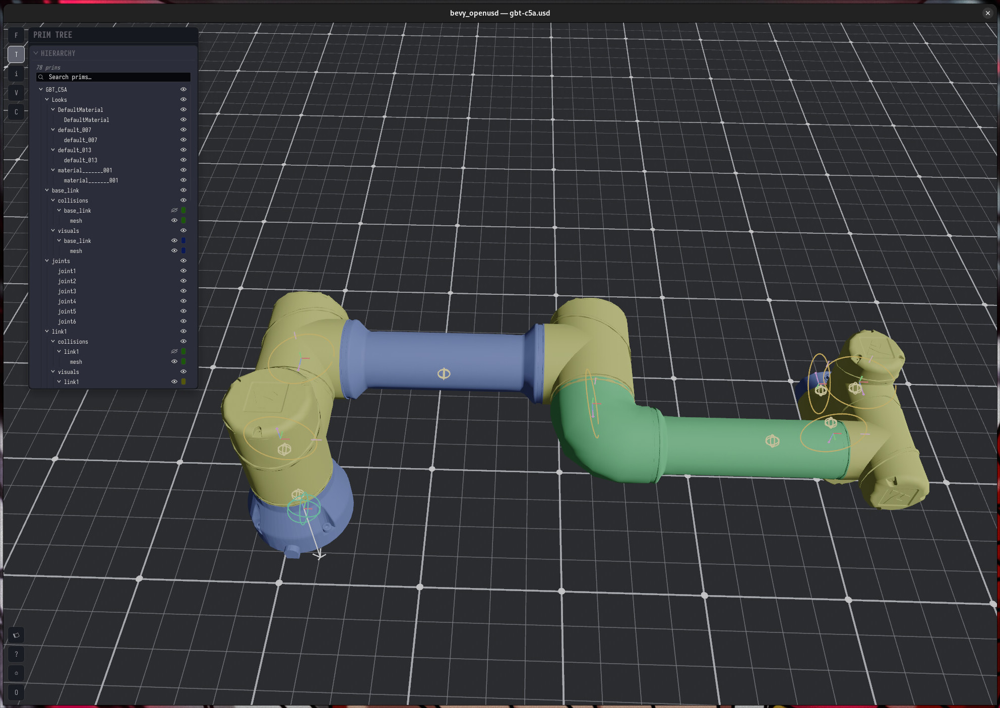

# bevy_openusd

A [Bevy](https://bevy.org) 0.18 plugin that loads
[OpenUSD](https://openusd.org) (`.usda` / `.usdc` / `.usdz`) files as native
Bevy scenes, plus an interactive viewer/editor binary that ships in the
same package.

The loader composes a stage through [`mxpv/openusd`](https://github.com/mxpv/openusd)
and projects it into ECS — one entity per composed prim, geometry +
materials + skinning + animation attached as Bevy components.



The screenshot above is the [Agilebot GBT-C5A](https://github.com/sh-agilebot/agilebot_isaac_usd_assets)
6-DOF collaborative arm — a real Isaac Sim production asset (binary
USDC, 5 layers composed, 165 prims, 7 rigid bodies, 7 joints, 1
articulation root) loaded with `make run ARGS="path/to/gbt-c5a.usd"`.
The physics overlay (toggle with `Y`) draws per-joint body frame triads,
fuchsia axis arrows, kind-coloured connection lines, and the revolute
limit arcs (orange ellipses). Backend-neutral: any downstream Bevy
physics engine (Rapier, Avian, …) can consume the marker components
without `bevy_openusd` taking a dep on a specific solver.

THIS WAS A PROJECT SUPORTED BY WUR (WAGENINGEN UNIVERSITY AND RESEARCH). A LOT OF CODE WAS COPIED FROM THE ORIGINAL REPO TO BE OPEND SOURCED.

## Run the viewer

```bash
cargo run -- path/to/scene.usd[abz]
```

`cargo run` (no args) opens the bundled `assets/external/usdz_sample.usdz`
demo. The viewer is the dogfood target during plugin development —
file-picker, tree panel, gizmos, animation scrub, variant selection.

## Use the plugin

```rust
use bevy::prelude::*;
use bevy_openusd::{UsdAsset, UsdPlugin};

fn main() {
    App::new()
        .add_plugins(DefaultPlugins)
        .add_plugins(UsdPlugin)
        .add_systems(Startup, load)
        .run();
}

fn load(mut commands: Commands, asset_server: Res<AssetServer>) {
    let handle: Handle<UsdAsset> = asset_server.load("scene.usdz");
    commands.insert_resource(Stage(handle));
}

#[derive(Resource)]
struct Stage(Handle<UsdAsset>);
```

## Layout

```
bevy_openusd/
├── src/
│   ├── lib/             plugin: asset loader, scene projection, schema readers
│   └── bin/             viewer binary (camera, ui, overlays, …)
├── crates/
│   └── usd_schemas/     typed schema readers — slated for upstreaming into
│                        openusd-rs, so kept as a sibling crate
├── examples/            standalone tools + probe scripts
├── tests/
│   └── stages/          curated .usda fixtures for integration tests
├── assets/              hand-authored .usda demos
│   └── external/        bundled USDZ archives (Kitchen_set, HumanFemale, …)
└── xtra/                external checkouts (openusd-rs, etc.)
```

## License

MIT.
